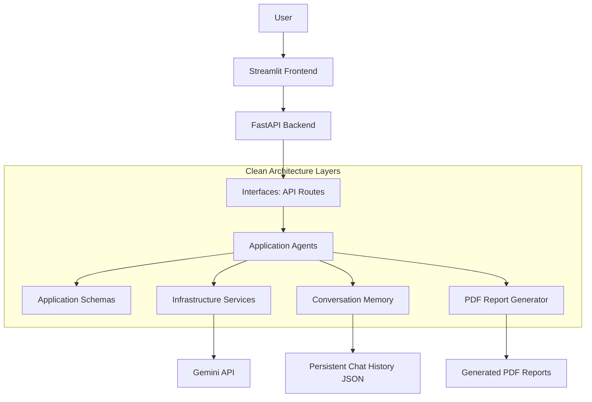
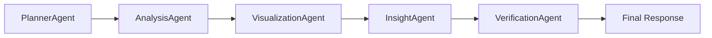
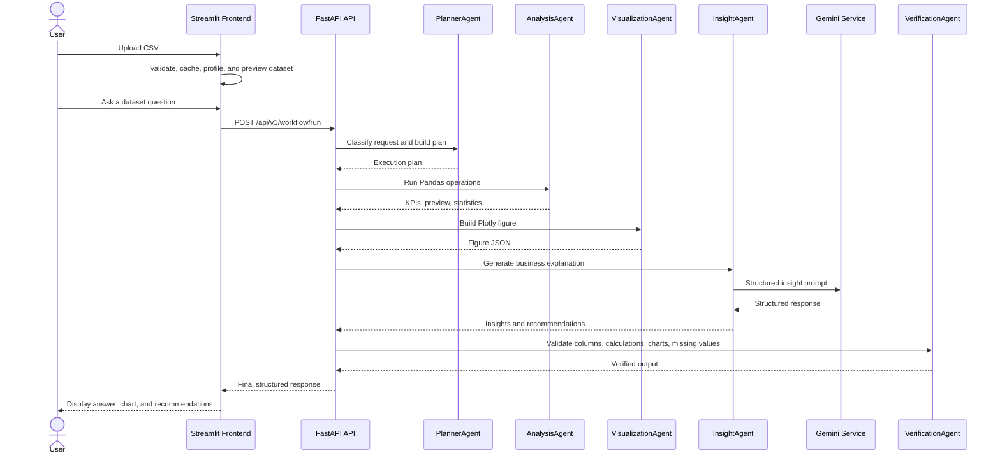

# DataWhisperer AI

DataWhisperer AI is a modular AI data assistant built with a FastAPI backend and a Streamlit frontend. It helps users upload CSV datasets, inspect data quality, run Pandas-based analysis, generate Plotly visualizations, ask context-aware questions, and export professional PDF reports.

The project follows Clean Architecture so data workflows, agents, providers, and UI code can evolve independently.

## Features

- FastAPI backend with versioned API routes
- Streamlit dashboard with dark mode, sidebar, chat, CSV upload, dataset preview, EDA panels, and suggested questions
- CSV validation, Pandas loading, missing values, duplicates, column types, statistics, and memory usage
- Automated exploratory data analysis with missing value heatmap, correlation matrix, histograms, boxplots, outlier detection, duplicate analysis, and quality report
- Gemini-backed structured responses with retries, timeout handling, and prompt templates
- LangGraph planner and workflow orchestration
- Analysis, Visualization, Insight, Verification, and Report agents
- Persistent conversation memory
- PDF report generation
- Docker-ready backend and frontend services
- Unit test coverage for core agents, services, EDA, reports, suggestions, memory, and CSV upload

## Architecture

DataWhisperer AI separates framework details from business workflows. FastAPI and Streamlit live at the edges, while agents and schemas live in the application layer.



### Backend Layers

- `backend/app/domain`: enterprise entities and domain services
- `backend/app/application`: agents, schemas, prompts, and use cases
- `backend/app/infrastructure`: external providers and persistence implementations
- `backend/app/interfaces`: FastAPI routes and HTTP-facing adapters
- `backend/app/core`: configuration, logging, exception handling, and app setup

### Frontend Modules

- `frontend/app.py`: Streamlit app entry point
- `frontend/components.py`: reusable dashboard UI components
- `frontend/csv_upload.py`: CSV validation, loading, and profiling
- `frontend/eda.py`: automated EDA report generation
- `frontend/suggestions.py`: dataset-aware suggested questions
- `frontend/gemini_client.py`: frontend API client for chat and memory
- `frontend/data_cache.py`: cached DataFrame, profile, EDA, and suggestion helpers
- `frontend/state.py`: Streamlit session state helpers
- `frontend/styles.py`: dashboard styling

## Agent Workflow

The full workflow connects the agents through LangGraph.



## Sequence Diagram



## Project Structure

```text
datawhisperer-ai/
|-- backend/
|   |-- app/
|   |   |-- application/
|   |   |   |-- agents/
|   |   |   |-- prompts/
|   |   |   |-- schemas/
|   |   |   `-- use_cases/
|   |   |-- core/
|   |   |-- domain/
|   |   |-- infrastructure/
|   |   |   |-- persistence/
|   |   |   `-- providers/
|   |   |-- interfaces/
|   |   |   `-- api/v1/routes/
|   |   `-- main.py
|-- frontend/
|   |-- app.py
|   |-- components.py
|   |-- csv_upload.py
|   |-- data_cache.py
|   |-- eda.py
|   |-- gemini_client.py
|   |-- state.py
|   |-- styles.py
|   `-- suggestions.py
|-- tests/
|-- docs/
|   `-- screenshots/
|-- .env.example
|-- Dockerfile
|-- docker-compose.yml
|-- requirements.txt
`-- README.md
```

## Installation Guide

### Prerequisites

- Python 3.11 or newer
- Docker Desktop, optional
- Gemini API key, required for Gemini-powered chat and insight generation

### Local Setup

1. Create a virtual environment.

```bash
python -m venv .venv
```

2. Activate the virtual environment.

```bash
# Windows PowerShell
.venv\Scripts\Activate.ps1

# macOS/Linux
source .venv/bin/activate
```

3. Install dependencies.

```bash
pip install -r requirements.txt
```

4. Create a local environment file.

```bash
# Windows PowerShell
Copy-Item .env.example .env

# macOS/Linux
cp .env.example .env
```

5. Configure Gemini in `.env`.

```bash
GEMINI_API_KEY=your-api-key
GEMINI_MODEL=gemini-3.5-flash
GEMINI_TIMEOUT_SECONDS=30
GEMINI_MAX_RETRIES=3
GEMINI_TEMPERATURE=0.2
```

### Run Backend

```bash
uvicorn backend.app.main:app --reload --host 0.0.0.0 --port 8000
```

Backend URLs:

- API root: `http://localhost:8000/api/v1`
- Swagger UI: `http://localhost:8000/docs`
- ReDoc: `http://localhost:8000/redoc`

### Run Frontend

```bash
streamlit run frontend/app.py
```

Frontend URL:

- Streamlit dashboard: `http://localhost:8501`

### Docker Setup

```bash
docker compose up --build
```

Docker service URLs:

- Backend: `http://localhost:8000`
- Frontend: `http://localhost:8501`

## Environment Variables

| Variable | Purpose | Default |
| --- | --- | --- |
| `APP_NAME` | FastAPI application name | `DataWhisperer AI` |
| `APP_ENV` | Runtime environment | `development` |
| `APP_DEBUG` | FastAPI debug mode | `true` |
| `APP_VERSION` | Application version | `0.1.0` |
| `API_HOST` | Backend bind host | `0.0.0.0` |
| `API_PORT` | Backend port | `8000` |
| `API_PREFIX` | Versioned API prefix | `/api/v1` |
| `BACKEND_CORS_ORIGINS` | Allowed frontend origins | `http://localhost:8501,http://127.0.0.1:8501` |
| `LOG_LEVEL` | Logging level | `INFO` |
| `FRONTEND_BACKEND_URL` | Backend base URL used by Streamlit | `http://localhost:8000` |
| `GEMINI_API_KEY` | Gemini API key | empty |
| `GEMINI_MODEL` | Gemini model name | `gemini-3.5-flash` |
| `GEMINI_TIMEOUT_SECONDS` | Gemini timeout | `30` |
| `GEMINI_MAX_RETRIES` | Gemini retry attempts | `3` |
| `GEMINI_TEMPERATURE` | Gemini generation temperature | `0.2` |
| `CHAT_HISTORY_PATH` | Persistent chat history file path | `data/chat_history.json` |
| `CHAT_MEMORY_LIMIT` | Recent exchanges included in context | `10` |

## API Documentation

All API routes are mounted under `/api/v1`.

| Method | Endpoint | Description |
| --- | --- | --- |
| `GET` | `/api/v1/health` | Service health check |
| `POST` | `/api/v1/planner/plan` | Classify a user request and return an execution plan |
| `POST` | `/api/v1/analysis/execute` | Execute Pandas filters, aggregations, sorting, KPIs, and statistics |
| `POST` | `/api/v1/visualization/figure` | Create a Plotly figure from records |
| `POST` | `/api/v1/insights/generate` | Generate business insights using Gemini |
| `POST` | `/api/v1/verification/verify` | Verify columns, calculations, chart validity, and missing values |
| `POST` | `/api/v1/workflow/run` | Run Planner, Analysis, Visualization, Insight, and Verification agents |
| `POST` | `/api/v1/reports/generate` | Generate a professional PDF report |
| `POST` | `/api/v1/chat/gemini` | Ask Gemini a dataset-aware chat question |
| `GET` | `/api/v1/chat/history/{session_id}` | Get persistent chat history |
| `DELETE` | `/api/v1/chat/history/{session_id}` | Reset a conversation |

### Example: Planner

```bash
curl -X POST http://localhost:8000/api/v1/planner/plan \
  -H "Content-Type: application/json" \
  -d "{\"request\":\"Show sales by region and recommend next actions\",\"dataset_context\":\"Rows: 100, Columns: region, sales\"}"
```

### Example: Analysis

```json
{
  "records": [
    {"region": "West", "sales": 100, "profit": 20},
    {"region": "East", "sales": 150, "profit": 30}
  ],
  "filters": [
    {"column": "sales", "operator": "gte", "value": 100}
  ],
  "aggregation": {
    "group_by": ["region"],
    "metrics": [
      {"column": "sales", "function": "sum", "alias": "total_sales"}
    ]
  },
  "statistics_columns": ["sales", "profit"],
  "preview_rows": 20
}
```

### Example: Workflow

```json
{
  "user_request": "Analyze sales performance and show the best chart",
  "records": [
    {"month": "Jan", "sales": 100, "profit": 20},
    {"month": "Feb", "sales": 140, "profit": 35}
  ],
  "dataset_context": "Monthly sales dataset with sales and profit columns",
  "expected_columns": ["month", "sales", "profit"],
  "required_columns": ["sales"]
}
```

## Screenshots

Screenshots should be stored in `docs/screenshots`.

| Screen | Placeholder |
| --- | --- |
| Dashboard overview | `docs/screenshots/dashboard-overview.png` |
| CSV upload and dataset preview | `docs/screenshots/csv-upload-preview.png` |
| EDA report panels | `docs/screenshots/eda-report.png` |
| Chat and suggested questions | `docs/screenshots/chat-suggestions.png` |
| PDF report output | `docs/screenshots/pdf-report.png` |

## Testing

Run the unit test suite:

```bash
pytest -q
```

Run syntax compilation checks:

```bash
python -m compileall -q backend frontend tests
```

## Future Roadmap

- Add authentication and role-based access control
- Add database-backed dataset, report, and conversation persistence
- Add dataset sampling and chunked processing for large CSV files
- Add export options for Excel, HTML, and Markdown reports
- Add chart editing controls in the Streamlit dashboard
- Add background jobs for long-running analysis and report generation
- Add observability with structured logs, request tracing, and metrics
- Add deployment manifests for cloud platforms
- Add CI workflow for linting, tests, and Docker builds
- Add end-to-end tests for backend and frontend workflows

## Development Notes

- Keep domain logic independent from FastAPI, Streamlit, databases, and third-party providers.
- Put reusable workflows and orchestration in `backend/app/application`.
- Put API-specific routes in `backend/app/interfaces`.
- Put Gemini and persistence implementations in `backend/app/infrastructure`.
- Use environment variables for runtime configuration.
- Keep Streamlit UI components reusable and side-effect-light.
